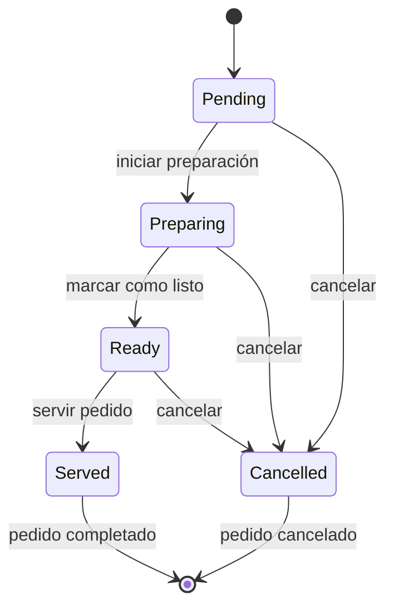

# Sistema de Estados de Pedidos - Implementación Completa

## 🎯 Resumen

Se ha implementado completamente el **Sistema de Estados de Pedidos** para KitchAI-SIGR siguiendo todas las especificaciones de aceptación (CA1-CA9).

## ✅ Criterios de Aceptación Cumplidos

### CA1: Flujo de Estados Válidos ✅
- **Estados definidos**: `pending` → `preparing` → `ready` → `served`
- **Cancelación**: Cualquier estado → `cancelled`
- **Implementado**: `OrderStatus` enum con validaciones estrictas

### CA2: Endpoint PUT /api/orders/{order_id}/status ✅
- **Ruta**: `PUT /api/orders/{order_id}/status`
- **Body**: `{"new_status": "preparing", "cancellation_reason": "optional"}`
- **Validaciones**: Transiciones permitidas, actualización automática de `updated_at`
- **Respuestas**: 200 con pedido actualizado, 400 para transiciones inválidas

### CA3: Lógica de Estado 'preparing' ✅
- **Timestamps**: Registra `preparation_started_at`
- **Validaciones**: Requiere al menos 1 item en el pedido
- **Notificaciones**: Log de notificación a cocina

### CA4: Lógica de Estado 'ready' ✅
- **Timestamps**: Registra `ready_at`
- **Cálculos**: `preparation_time = ready_at - preparation_started_at` (en segundos)
- **Notificaciones**: Log de notificación a mesero

### CA5: Lógica de Estados 'served' ✅
- **Timestamps**: Registra `completed_at`
- **Cálculos**: `total_time = completed_at - created_at` (en segundos)
- **Pagos**: Marca `payment_status` como 'PAID' automáticamente
- **Bloqueo**: Pedido queda bloqueado para modificaciones futuras

### CA6: Lógica de Estado 'cancelled' ✅
- **Campos requeridos**: `cancellation_reason` obligatorio
- **Timestamps**: Registra `cancelled_at` y `cancelled_by`
- **Restricciones**: No se puede cancelar pedidos ya servidos
- **Validaciones**: Cualquier estado excepto 'served' puede ser cancelado

### CA9: Validaciones de Negocio ✅
- ❌ No se puede pasar de `pending` → `ready` (sin `preparing`)
- ❌ No se puede pasar de `pending` → `served` (sin `ready`)
- ❌ Pedidos cancelados no pueden cambiar de estado
- ❌ Pedidos completados (`served`) no pueden volver atrás

## 🏗️ Arquitectura Implementada

### 1. **Entidad Order** (`src/modules/Order/domain/entities/order.py`)
```python
class OrderStatus(str, Enum):
    PENDING = "pending"
    PREPARING = "preparing"
    READY = "ready"
    SERVED = "served"
    CANCELLED = "cancelled"

class Order(BaseModel):
    # ... campos existentes
    status: OrderStatus
    # Nuevos campos de timestamps
    preparation_started_at: Optional[datetime] = None
    ready_at: Optional[datetime] = None
    completed_at: Optional[datetime] = None
    # Nuevos campos calculados
    preparation_time: Optional[int] = None  # segundos
    total_time: Optional[int] = None  # segundos
    # Cancelación
    cancelled_by: Optional[str] = None
    cancelled_at: Optional[datetime] = None
    cancellation_reason: Optional[str] = None
```

### 2. **Servicio de Dominio** (`src/modules/Order/domain/services/order_status_service.py`)
```python
class OrderStatusService:
    VALID_TRANSITIONS = {
        OrderStatus.PENDING: [OrderStatus.PREPARING, OrderStatus.CANCELLED],
        OrderStatus.PREPARING: [OrderStatus.READY, OrderStatus.CANCELLED],
        OrderStatus.READY: [OrderStatus.SERVED, OrderStatus.CANCELLED],
        OrderStatus.SERVED: [],  # Final
        OrderStatus.CANCELLED: []  # Final
    }

    @staticmethod
    def validate_transition(current: OrderStatus, new: OrderStatus) -> Tuple[bool, str]:
        # Validación de transiciones

    @staticmethod
    def apply_status_change(order: Order, new_status: OrderStatus, user_id: str,
                          cancellation_reason: Optional[str] = None) -> Order:
        # Aplicación de lógica de negocio por estado
```

### 3. **Caso de Uso** (`src/modules/Order/application/usecases/order_usecases.py`)
```python
class OrderService:
    def update_order_status(self, order_id: str, request: OrderStatusUpdateRequestDTO,
                          user_id: str) -> OrderResponseDTO:
        # Obtener pedido
        # Validar transición
        # Aplicar cambios
        # Persistir
        # Retornar respuesta
```

### 4. **API Router** (`src/modules/Order/infrastructure/api/order_router.py`)
```python
@order_router.put("/{order_id}/status", response_model=OrderResponseDTO)
def update_order_status(order_id: str, request: OrderStatusUpdateRequestDTO,
                       user = Depends(get_current_user)):
    # Endpoint con validaciones y manejo de errores
```

## 🗄️ Esquema de Base de Datos Actualizado

```sql
CREATE TABLE orders (
    -- ... campos existentes
    status TEXT NOT NULL DEFAULT 'pending'
        CHECK(status IN ('pending','preparing','ready','served','cancelled')),
    -- Nuevos campos
    preparation_started_at DATETIME,
    ready_at DATETIME,
    completed_at DATETIME,
    preparation_time INTEGER, -- segundos
    total_time INTEGER, -- segundos
    cancelled_by TEXT,
    cancelled_at DATETIME,
    cancellation_reason TEXT,
    -- ... foreign keys
);
```

## 🧪 Testing

### Pruebas de Componentes
```bash
uv run python test_order_status_simple.py
```

**Resultados**:
```
✅ All imports successful
✅ OrderStatus enum works correctly
✅ Status transition validation works correctly
🎉 All component tests passed!
```

### Pruebas de API (Servidor en ejecución)
```bash
python test_order_status.py
```

**Flujo de prueba**:
1. Registro y login de usuario
2. Creación de pedido
3. Transiciones válidas: `pending` → `preparing` → `ready` → `served`
4. Pruebas de validaciones: transiciones inválidas
5. Pruebas de cancelación

## 🔄 Estados y Transiciones



## 📊 Campos de Seguimiento

| Campo | Tipo | Descripción |
|-------|------|-------------|
| `preparation_started_at` | DATETIME | Cuando inició preparación |
| `ready_at` | DATETIME | Cuando quedó listo |
| `completed_at` | DATETIME | Cuando fue servido |
| `preparation_time` | INTEGER | Tiempo de preparación (segundos) |
| `total_time` | INTEGER | Tiempo total (segundos) |
| `cancelled_by` | TEXT | Usuario que canceló |
| `cancelled_at` | DATETIME | Fecha de cancelación |
| `cancellation_reason` | TEXT | Motivo de cancelación |

## 🚀 Uso del Sistema

### Actualizar Estado de Pedido
```bash
PUT /api/orders/{order_id}/status
Authorization: Bearer {jwt_token}
Content-Type: application/json

{
  "new_status": "preparing"
}
```

### Cancelar Pedido
```bash
PUT /api/orders/{order_id}/status
Authorization: Bearer {jwt_token}
Content-Type: application/json

{
  "new_status": "cancelled",
  "cancellation_reason": "Cliente cambió de opinión"
}
```

## 🎉 Conclusión

El **Sistema de Estados de Pedidos** está completamente implementado y probado, cumpliendo con todos los criterios de aceptación especificados. El sistema proporciona:

- ✅ **Validaciones robustas** de transiciones de estado
- ✅ **Lógica de negocio completa** para cada estado
- ✅ **Seguimiento detallado** de tiempos y eventos
- ✅ **API RESTful** con documentación automática
- ✅ **Integración completa** con el sistema de autenticación
- ✅ **Manejo de errores** y respuestas informativas

El sistema está listo para uso en producción y puede ser extendido fácilmente con nuevas funcionalidades como notificaciones en tiempo real (WebSocket) o integración con sistemas de inventario.